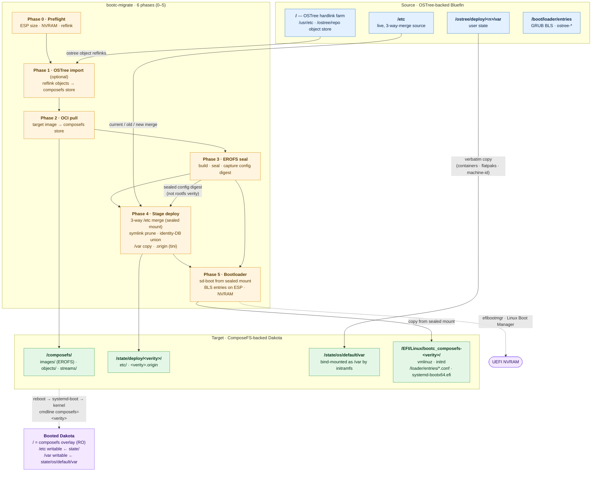

# bootc-migrate

[](https://github.com/tuna-os/bootc-migrate/actions/workflows/ci.yml)
[](https://github.com/tuna-os/bootc-migrate/actions/workflows/e2e-tests.yml?query=branch%3Amain)

In-place migration utility for bootc systems. It converts OSTree systems (like
Bluefin) into ComposeFS systems (like Dakota). It preserves `/home`, `/var`,
`/etc`, flatpaks, containers, and user accounts without a fresh install.

## Migrate Bluefin → Dakota (quick start)

The common case: **Bluefin stable (btrfs) → Dakota stable**. Five steps. Your
old OSTree deployment stays in the boot menu as a fallback the whole time.

> ⚠️ **Back up anything you can't afford to lose first.** This rewrites how your
> system boots. It preserves `/home`, `/var`, `/etc`, flatpaks, container
> storage, and user accounts — but treat it as risky until you've rebooted and
> confirmed everything works. It's reversible until you run `commit` (step 5).

**1. Get the migrator.** Download the latest prebuilt binary (x86_64; for arm64
swap in `aarch64-unknown-linux-gnu`):

> **Release-naming note.** The project changed its repository name from
> `bootc-migrate-composefs` to `bootc-migrate` after v0.2.0. `release.yml`
> publishes under the new name, so from **v0.6.0** the tarball, binary, and
> container image are all `bootc-migrate`. The commands below reflect that.
> To install the older v0.2.0 artifacts, substitute `bootc-migrate-composefs`
> in the paths.

```bash
curl -fsSL -o bmc.tar.gz \
  https://github.com/tuna-os/bootc-migrate/releases/latest/download/bootc-migrate-x86_64-unknown-linux-gnu.tar.gz
tar xzf bmc.tar.gz
sudo install -m755 bootc-migrate /usr/local/bin/bootc-migrate
```

<details><summary>…or pull the container image</summary>

A minimal image ships the same binary, useful when GitHub Releases is rate-limited/blocked, or to `COPY --from=` it into another Containerfile:

```bash
podman create --name bmc-extract ghcr.io/tuna-os/bootc-migrate:latest
podman cp bmc-extract:/usr/local/bin/bootc-migrate .
podman rm bmc-extract
sudo install -m755 bootc-migrate /usr/local/bin/bootc-migrate
```
</details>

<details><summary>…or build from source (needs Rust)</summary>

```bash
git clone https://github.com/tuna-os/bootc-migrate
cd bootc-migrate
cargo build --release
sudo install -m755 target/release/bootc-migrate /usr/local/bin/
```
</details>

**2. Dry-run** — makes no changes and checks that your system is ready:

```bash
sudo bootc-migrate \
  --target-image ghcr.io/projectbluefin/dakota:stable --dry-run
```

**3. Migrate** (~5–25 min):

```bash
sudo bootc-migrate \
  --target-image ghcr.io/projectbluefin/dakota:stable
```

**4. Reboot** — the new composefs entry is the default. If anything looks wrong,
pick the old **Bluefin / OSTree** entry in the boot menu to get straight back.

```bash
sudo systemctl reboot
```

**5. Confirm, then make it permanent:**

```bash
cat /proc/cmdline | grep -o 'composefs=[0-9a-f]*'   # confirms composefs boot
sudo bootc-migrate commit                 # one-way; removes the OSTree fallback
```

> ⚠️ **Note:** Phase 4 copies `/var` to the composefs side.
> After migration, the two `/var` trees are independent.
> Changes on the composefs side do not appear if you roll back to OSTree.
> Commit only when you trust the new system.

That's it. For flags, rollback, recovery steps, and phase details, see
[Usage — end-to-end walkthrough](#usage--end-to-end-walkthrough).
On **Bluefin LTS** (XFS) or systems with **LVM / LUKS / a dedicated `/var`
partition**, the tool handles those automatically — see
[docs/filesystem-support.md](docs/filesystem-support.md).

> **Status: CI-validated, released, and tested on real hardware.**
> Fourteen E2E scenarios run in CI on every push to `main`.
> Prebuilt binaries are on the [Releases](https://github.com/tuna-os/bootc-migrate/releases) page.

## Interactive wizard (TUI)

Prefer a guided interface over flags? Run `bootc-migrate tui` to launch a
terminal wizard. The wizard walks through target image selection, options,
reviews, and live progress logs:

```bash
sudo bootc-migrate tui
```


The wizard defaults to `--dry-run`. It builds the CLI command shown on the
Review screen. You do not need root to browse options. Root access is
necessary when you run the migration.

## Architecture



**Key insight:** Phase 3 runs `bootc internals cfs oci seal` which prints the
sealed manifest's config digest. Phases 4 and 5 pass the **sealed config
digest** to `bootc cfs oci mount`. The overlay shows the contents of files for
`/etc`, kernel, initrd, and modules. This prevents layer streams at runtime.

## What it does

Six phases (numbered 0–5 to match console output), run as one command:

- **Phase 0 — Preflight** — check free space, reflink, UEFI, and ESP capacity.
- **Phase 1 — OSTree import** *(optional)* — reflinks OSTree files into the
  composefs store so Phase 2 mostly deduplicates data. Skip with `--skip-import`.
- **Phase 2 — OCI pull** — `bootc internals cfs oci pull` of the target bootc
  image into the composefs store.
- **Phase 3 — EROFS seal** — builds and seals the EROFS image. Captures the
  sealed config digest for Phase 4.
- **Phase 4 — Stage deploy** — 3-way `/etc` merge, identity database union,
  symlink cleanup, `/var` preservation, and `.origin` metadata.
- **Phase 5 — Bootloader** — copies `systemd-bootx64.efi` to the ESP, checks
  aliases for Wi-Fi modules, writes BLS entries, and registers `Linux Boot Manager`
  in UEFI NVRAM.

After a successful reboot into the composefs entry, `bootc-migrate
commit` removes the OSTree fallback and makes composefs permanent.

## Usage — end-to-end walkthrough

> **Before you start.** This tool changes bootloader state and copies or reuses
> all of `/var`. Don't run it on a machine you can't reinstall in a pinch.
> Until you run `commit`, it's reversible — but a fresh backup is still
> cheap insurance.

### 1. Decide your target

The migration takes a `--target-image` — the composefs-backed bootc image
you want to end up on. Today the validated path is **Bluefin → Dakota**:

```
ghcr.io/projectbluefin/dakota:stable     # default target
```

For other OSTree systems (Aurora, Silverblue), set `--target-image` to the
composefs equivalent.

The target must share a base lineage with the source: its `ID_LIKE` must
overlap yours, or both images must ship the same package manager. Bluefin,
Silverblue and CentOS-based images are all one dnf family. The tool
refuses a target from another family, for example Fedora → openSUSE,
because the standard `/etc` merge would carry your Fedora configuration
onto openSUSE. Pass `--accept-cross-base` to migrate with the cross-family
`/etc` policy instead. See "Cross-family targets" below.

To migrate to an image you built yourself instead of a published one, see
[docs/local-images.md](docs/local-images.md). Serve it from a registry the
machine can reach. An image that exists only in podman storage is not
enough. The capability scan and the Phase 4/5 fallbacks read the target
over the registry API.

### 2. Check readiness with a dry-run

```bash
sudo bootc-migrate \
  --target-image ghcr.io/projectbluefin/dakota:stable \
  --dry-run
```

Things to confirm in the report:

- `Booted bootc backend: ostree` — the conversion runs from here. `composefs`
  means the conversion is done, and the tool swaps the deployment image
  instead (`bootc switch`). Only `none` (not a bootc deployment) is a blocker.
- `UEFI Boot Mode: Yes` + `NVRAM writable: Yes` — required for the
  systemd-boot path; on BIOS-only or locked NVRAM pass `--bootloader grub2`.
- `ESP Free Space: ≥ 150 MB` — we copy `systemd-bootx64.efi` from the
  target image onto the ESP.
- `Reflink (CoW) Support: Yes` — btrfs and XFS both support reflink.
- `ComposeFS free space: ≥ 1.1 × ostree_repo_size` — the composefs object
  store is built with reflink copies of your OSTree objects.

Optionally, preview what Phase 4's `/etc` merge will see before you run it:

```bash
sudo bootc-migrate etc-drift
```

Lists every path where your live `/etc` has diverged from the OSTree factory
default (added/modified/removed/type-changed), read-only. Useful to find
stale customizations you do not need before they carry forward into the
migrated system.

### 3. Run the migration

```bash
sudo bootc-migrate \
  --target-image ghcr.io/projectbluefin/dakota:stable
```

Expect ~5–10 minutes on warm caches, ~15–25 minutes on a cold pull. Six
phase headers (0–5) print as it goes:

| Phase | What's happening | Why it might take a while |
|---|---|---|
| **0 — Preflight** | Same checks as `--dry-run` | seconds |
| **1 — OSTree import** *(optional)* | Reflinks existing OSTree file objects into the composefs object store so Phase 2 mostly dedups | tens of seconds to a few minutes; skip with `--skip-import` |
| **2 — OCI pull** | `bootc internals cfs oci pull` of the target image | minutes (network-bound) |
| **3 — EROFS image** | Builds + fs-verity-signs the composefs metadata image | seconds |
| **4 — Stage deploy** | 3-way `/etc` merge (from sealed mount) or, across families, the cross-family policy; dangling-symlink prune, identity-DB line-union, `/var` copy or dedicated-subvolume preservation, `.origin` file written | ~1 minute |
| **5 — Bootloader** | Copies systemd-boot from mounted image, writes BLS entries, registers NVRAM | ~30s |

When it ends with `=== MIGRATION COMPLETED ===` the on-disk state is
ready. Reboot:

```bash
sudo systemctl reboot
```

### 4. Validate the composefs boot

Log in (your existing accounts and SSH keys still work) and check:

```bash
cat /proc/cmdline                                       # must contain composefs=<hex>
bootc status                                            # should report the composefs deployment
bootc status --json | jq .status.booted.composefs        # non-null
```

Spend a day on it. Run your usual workflow — flatpaks, dnf, containers,
homebrew, GNOME extensions, whatever. Everything that lived under `/home`,
`/var`, and `/etc` on Bluefin should be where you left it. If something
is missing or broken, you can roll back (see below).

A login banner (`/etc/motd.d/85-bootc-migrate`) reminds you to run
`commit` on every login until you do, so a live migration doesn't sit
forgotten in this dual-boot state indefinitely. It clears itself once
`commit` runs — or once `undo` runs, since at that point there's nothing
left to commit.

### 5. Make it permanent (one-way)

Once you trust the new system:

```bash
sudo bootc-migrate commit
```

This removes the OSTree fallback from the ESP, drops GRUB2 boot artifacts,
and reclaims ~14 GiB of OSTree object store. The systemd-boot entry becomes
the sole default with timeout 0.

### Flags

| Flag                  | Purpose                                                            |
| --------------------- | ------------------------------------------------------------------ |
| `--dry-run`           | Print every action; touch nothing                                  |
| `--skip-import`       | Skip phase 1 (faster when target image is mostly new content)      |
| `--bootloader grub2`  | Stay on GRUB2 instead of installing systemd-boot                   |
| `--skip-preflight`    | Bypass preflight checks (don't, unless you know exactly why)       |
| `--force`             | Proceed past non-fatal warnings                                    |
| `--accept-cross-base` | Migrate to a target from another OS family with the cross-family `/etc` policy (see below). `--force` does not imply it |

### Cross-family targets

`bootc-migrate` reads the target image's `os-release` and looks for its
package manager before it stages anything. Two images are one family when
their `ID`/`ID_LIKE` sets overlap or when both ship the same package
manager (dnf, zypper, apt, pacman or apk). When the sets share nothing and
the package managers differ (Fedora → openSUSE, Fedora → Debian), it
refuses. When one image ships no known package manager (Dakota is GNOME
OS-based), it warns and keeps the standard merge. The standard 3-way `/etc` merge keeps every file you
changed on the source. Across families, that carries one family's
package-manager, PAM, service and policy defaults onto the other.

With `--accept-cross-base`, Phase 4 applies the cross-family policy
instead:

- Every path the target ships takes the target's copy.
- The tool drops every path that only the source's vendor shipped.
- The tool keeps machine state verbatim: `fstab`, `crypttab`,
  `mdadm.conf`, `hostname`, `hosts`, `localtime`, `locale.conf`,
  `vconsole.conf`, `adjtime`, SSH host keys and `sshd_config.d/`, saved
  NetworkManager connections, and `sudoers.d/`. It also keeps every path
  you added yourself.
- Identity databases take the target's numeric ids first, and the tool
  appends your accounts. Password entries stay yours. The tool then
  changes the owner of each file under `/var` to match.
- Every displaced file you had changed stays beside its replacement as
  `<path>.rebase-old`. The tool deletes nothing.
- When the target enforces an SELinux policy that the source did not, a
  one-shot unit relabels `/etc` and `/var` on first boot.

The tool prints the report and writes it to
`/sysroot/state/deploy/<verity>/bootc-migrate-cross-family-report.json`.
This route is exploratory: one non-gating E2E cell exercises it. See
[ROADMAP.md](ROADMAP.md) and
[#256](https://github.com/tuna-os/bootc-migrate/issues/256).

### Move system Steam into Flatpak Steam

After you install and run `com.valvesoftware.Steam` once, its per-user
data can absorb a system Steam install without new game downloads:

```bash
bootc-migrate system-to-flatpak-steam --dry-run
bootc-migrate system-to-flatpak-steam
```

Run it as the desktop user, **without** `sudo`, after you close Steam and all
Steam games. The tool uses filesystem renames only to move `steamapps`, `userdata`,
and `config` from `~/.local/share/Steam` into Flatpak Steam directories.
The tool keeps existing Flatpak versions and library registries in a
timestamped rollback directory under `~/.var/app/com.valvesoftware.Steam/`.

The command keeps runtime files for Steam and folders like `~/Games`.
Add a Flatpak filesystem override for `~/Games` separately if Steam shortcuts need it.

### Rollback / recovery

Until you run `commit`, the migration is **reversible**. The previous OSTree
deployment stays bootable:

- Phase 5 only *adds* the systemd-boot composefs entry; it never deletes the
  existing `/boot/loader/entries/ostree-*.conf` files.
- The original `/ostree/deploy/<n>/deploy/<commit>.0/` rootfs and
  `/ostree/deploy/<n>/var/` stay on disk.
- Phase 4 copies `/var` or reuses it in place. The migration does not delete
  original data.
- The tool pushes `Linux Boot Manager` to the front of NVRAM `BootOrder`.
  The `Fedora` shim entry remains listed.

#### Automatic rollback subcommand

To return to the original OSTree deployment with the command line:

```bash
sudo bootc-migrate rollback --reboot
# or via the universal re-base CLI:
sudo bootc-rebase rollback --reboot
```

This verifies prerequisites, re-orders UEFI `BootOrder` so the OSTree entry (Fedora/GRUB) takes top priority, and reboots immediately into the OSTree deployment.

#### Manual firmware recovery

If the system fails to boot into composefs or NVRAM state breaks:

1. Power on; tap the firmware boot-menu key (commonly **F12**, **F8**, or **Esc**).
2. Pick the `Fedora` entry. GRUB will show the original `ostree:0` menu.
3. Boot it. You land on the pre-migration system with its `/var` and `/etc` intact.

From a booted composefs session, run:

```bash
sudo efibootmgr -v | grep -E 'Fedora|Linux Boot Manager'
sudo efibootmgr --bootnext <Boot####-of-Fedora>
sudo systemctl reboot
```

The tool writes diagnostic snapshots and logs under `/var/log/bootc-migrate/` on
every run (`preflight-*.json` and `migration.log`). You can reconstruct boot
settings if NVRAM is lost.

After `bootc-migrate commit` runs, the tool removes the OSTree fallback from
the ESP. The E2E test exercises the full round-trip (composefs → OSTree → composefs)
on every run.

### What's preserved

Validated end-to-end (21+ assertions per run; see `tests/run-e2e.sh`):

- **/var data** — `/var/lib/*`, `/var/log/*`, `/var/cache/*`, containers,
  flatpak system installs, machine-id, hidden dirs and symlinks.
- **User homes** — `/var/home/<user>/`, dotfiles, project trees, SSH keys,
  wallpapers, extensions, dconf user db, and flatpak installs.
  When an OSTree source uses `/home -> /var/home`, a bind mount keeps paths valid.
- **/etc state** — `/etc/sudoers.d/*`, `/etc/hosts` edits, custom
  `sshd_config.d/*`, custom config files in `/etc/`, edits to
  `/etc/hostname`, and `/etc` symlinks.
- **Accounts** — `/etc/passwd`, `/etc/shadow`, and `/etc/group` line-union
  merged so existing users survive and the tool adds new system users (messagebus, polkitd).

What's intentionally *not* carried forward:

- OSTree/rpm-ostree state markers (`.updated`, `.rpm-ostree-shadow-mode-fixed2.stamp`)
- GRUB2 config files (`grub2.cfg`, `grub2-efi.cfg`, `/etc/grub.d/`) — the
  target uses systemd-boot
- Source-image `/etc` files the target image removed (e.g. `sshd_config.d/40-redhat-crypto-policies.conf`
  which references `/etc/crypto-policies/` paths Dakota doesn't ship)

### Troubleshooting

| Symptom | Likely cause | Fix |
|---|---|---|
| Phase 0 refuses with "System is not booted into a bootc deployment" | Neither an ostree nor a composefs deployment is booted | Nothing to migrate from; check `bootc status` |
| Phase 2 fails with ENOSPC mid-pull | `/sysroot/composefs` is tight on the 1.1× heuristic | Free space or grow the partition, then rerun |
| Post-reboot `cat /proc/cmdline` shows `ostree=` not `composefs=` | Firmware ignored the new NVRAM entry, or OVMF loaded `Fedora\shim` instead | Use firmware boot menu to pick `Linux Boot Manager`; if that fails, fall back to OSTree and report the firmware quirk |
| `bootc status` says "No manifest_digest in origin" | You're on an old build of this tool | Update to `main` — version info is on the first line of the migration log |
| SSH key auth broken post-migration | Permissions changed during /var copy | Boot OSTree fallback and `chmod 700 ~/.ssh; chmod 600 ~/.ssh/authorized_keys` |
| GNOME boots but session settings (wallpaper, accent) look wrong | dconf database needs recompile | `dconf update` as your user, or log out + back in |
| Phase 5 refuses because the target kernel has no module alias for a wireless device | The image omits the driver for Wi-Fi hardware present on the source system | Fix or update the target image. Use `--force` only when alternate networking is available and losing Wi-Fi is acceptable |
| Refused with "Cross-family re-base detected" | The target's `ID_LIKE` shares nothing with the host's and its package manager differs | Re-run with `--accept-cross-base` to use the cross-family `/etc` policy, or pick a target from the same family |
| The new image boots, but `/etc` still looks like the old distribution | A cross-family migration ran with a build that predates #256 | Update the tool, boot the OSTree entry, and migrate again with `--accept-cross-base` |
| Phase 2 fails with "podman could not refresh" on your own image | The machine cannot pull the image, or podman rejects a plain-HTTP registry | Mark the registry insecure and confirm with a manual `podman pull` — see [docs/local-images.md](docs/local-images.md) |
| Migration went wrong and you want to undo it | Something failed mid-migration | Run `sudo bootc-migrate undo` (removes composefs boot artifacts, keeps object store) or `sudo bootc-migrate undo --full` (full cleanup including object store); then reboot into OSTree |

## Requirements

- Booted on an OSTree-backed bootc system (Bluefin, Aurora, Silverblue…)
- UEFI firmware with writable NVRAM (for the systemd-boot path; GRUB2 fallback
  works on BIOS)
- Btrfs or XFS sysroot with reflink/CoW support
- ESP with ≥150 MB free
- ≥ `1.1 × ostree_repo_size` free on `/sysroot/composefs` (no reflink: 1.5×)
- Outbound registry access for `bootc internals cfs oci pull`.
  (Phase 2 fetches the target image. Later phases read artifacts from the mount.)
  A local registry works too — see [docs/local-images.md](docs/local-images.md).

## Building

```
cargo build --release
```

Drops a single binary at `target/release/bootc-migrate`.
Needs Rust 1.85+ and a Linux host with `libxkbcommon-dev`.

## End-to-end tests

A QEMU-based E2E harness lives in `tests/run-e2e.sh`. It installs Bluefin
into a disk image, runs the migration against a registry mirror of the
Dakota target image, reboots, and validates the full round-trip.

```
sudo ./tests/run-e2e.sh
```

Overridable via env: `BASE_IMAGE`, `TARGET_IMAGE`, `DISK_SIZE`,
`FILESYSTEM`, `SKIP_SETUP`, `E2E_MODE`.

The CI matrix runs fourteen cells (see `.github/workflows/e2e-tests.yml`, which
is authoritative):

| Cell | Base → target | Filesystem | Disk |
|---|---|---|---|
| composefs migration | bluefin:stable → dakota:stable | btrfs | 40G |
| composefs migration | bluefin:lts → dakota:stable | ext4 | 40G |
| composefs migration | bluefin:lts → dakota:stable | xfs+crypt | 40G |
| composefs migration | bluefin:lts → dakota:stable | xfs+lvm+crypt | 60G |
| ostree re-base | bluefin:stable → dakota:stable | btrfs | 40G |
| ostree re-base, GNOME→KDE (non-gating) | bluefin:stable → aurora:stable | btrfs | 40G |
| TUI-driven migration | bluefin:stable → dakota:stable | btrfs | 40G |
| cross-family migration (non-gating) | bluefin:stable → bootcrew/opensuse-bootc:latest | btrfs | 40G |
| composefs → ostree (non-gating) | dakota:stable → fedora-bootc:44 | btrfs | 40G |
| composefs image swap (non-gating) | dakota:stable → utah:testing | btrfs | 40G |
| tunaOS desktop ring, ostree re-base with `--de-migrate` (4 cells, non-gating) | albacore gnome → niri → cosmic → xfce → gnome | btrfs | 40G |

Only the two `xfs*` cells exercise the ext4-loopback composefs store (XFS has
no fs-verity); btrfs and ext4 seal in place.

## Layout

A Cargo workspace with three crates (see [ROADMAP.md](ROADMAP.md)):

- `crates/bootc-migrate-core` — capability library: phases, preflight checks,
  `/etc` merge (`mergetc`), OSTree scans, stream extraction, transactions,
  capability scans, UID remaps, UEFI audits, and desktop migrations.
- `crates/bootc-migrate` — **the protected MVP binary** described
  above. CLI surface (clap), `commit`/`undo`/`rollback` subcommands, the TUI
  wizard. Its E2E cells are untouchable regression gates — this binary's
  behavior doesn't change as new capability lands in `bootc-rebase`.
- `crates/bootc-rebase` — the universal binary for re-base; see below.
- `tests/run-e2e.sh` — QEMU E2E harness that tests both binaries.

## `bootc-rebase` — the universal re-base engine

`bootc-migrate` above does one proven thing: OSTree → ComposeFS.
`bootc-rebase` is the general tool. It provides a table over
**backend × strategy** to cover re-base scenarios
(same-backend image swaps, cross-backend conversions, bootloader changes,
cross-distro-family moves, desktop-environment switches). It's newer and less
battle-tested than the MVP binary; treat subcommands marked *skeleton* or
*read-only* below as previews, not yet full features.

```bash
cargo build --release -p bootc-rebase
```

| Subcommand | What it does | Status |
|---|---|---|
| `scan <image>` | Registry-streamed capability probe of a target image — composefs/ostree readiness, fs-verity requirement, transient root/etc, bootloader payload, desktops, base OS identity, sysusers, initramfs flavor, filesystem expectation, and a `Compatible: YES/NO` verdict with reasons. `--json` for machine output. | Done |
| `rebase --target-image <image>` | Re-base the running system, routing on `--source-backend`/`--target-backend` through the strategy table below. `--plan` prints the route, selected phases, and bootloader policy, then exits without touching the system. | Implemented for ostree→composefs (the MVP pipeline), composefs→composefs (image swap), ostree→ostree (native `bootc switch`, with cross-base UID/GID remap when host and target disagree on distro family — pass `--accept-cross-base` to proceed past the report), and composefs→ostree (`OstreeInstall`, #260: the target's own `bootc install to-existing-root` builds an OSTree deployment beside the composefs root; `/etc` merged, `/var` copied, composefs ESP artifacts restored and its firmware entry kept as rollback; exploratory, one non-gating cell). On the composefs routes `--accept-cross-base` also accepts a cross-*family* target and, on the conversion route, selects the cross-family `/etc` policy (#256) |
| `rollback [--reboot]` | Re-order UEFI `BootOrder` back to the previous deployment. | Done |
| `boot-entries [--json] [--interactive] [--rename-branding] [--apply] [--undo]` | Enumerate and classify UEFI boot entries: dead (loader path missing), generic-label, duplicate, firmware-managed, plus which are protected and why. **Dry-run by default** — a bare invocation is the read-only audit. `--interactive` opens a checklist (protected entries are unselectable), `--rename-branding` proposes renaming the booted entry to `PRETTY_NAME`, `--apply` writes the result to NVRAM after a typed confirmation and a restorable snapshot, and `--undo` replays that snapshot. | Audit and the cleanup **planner** are unit-tested (protections, the last-bootable-entry guard, and the "every entry looks dead ⇒ the ESP is wrong" refusal). The gating OSTree re-base E2E cell also renames a live OVMF NVRAM entry, applies the plan, undoes it, and asserts byte-identical `efibootmgr -v` output. This covers the executor and snapshot restore; it does **not** cover the separate, unimplemented GRUB2→systemd-boot flip ([#31](https://github.com/tuna-os/bootc-migrate/issues/31), [#189](https://github.com/tuna-os/bootc-migrate/issues/189)) |
| `de-migrate stash\|restore` | Move a user's desktop-environment config (GNOME dconf/gnome-shell, KDE kdeglobals/plasma, COSMIC, niri, XFCE) into or out of a stash directory around a cross-DE re-base — union of paths per issue [#68](https://github.com/tuna-os/bootc-migrate/issues/68), never deletes. `--run-hooks` executes `pre-switch.d`/`post-switch.d` scripts with `REBASE_FROM_DE`/`REBASE_TO_DE`/`REBASE_STASH_DIR`/`REBASE_HOME` set. `--dry-run` previews without touching anything. | Done. Also runs automatically inside `rebase --de-migrate`; this subcommand remains the manual escape hatch for images shipping several desktops (which detection refuses to guess between) |
| `rebase --de-migrate` | Detects the desktop environment the target image ships (registry-streamed session files, session binaries, and display-manager default session — no `podman pull`) and the one this host runs. When they differ, stashes every human account's outgoing DE config before staging and re-exposes any stash a previous re-base in the other direction left behind, running the `pre-switch.d`/`post-switch.d` hooks around each. | Done, unit-tested; **off by default** — a re-base never touches per-user desktop state unless asked to. The non-gating Bluefin→Aurora E2E cell passes `--de-migrate`, seeds GNOME config, and asserts that the cross-DE plan and stash are created. Because target desktop detection uses the registry scan, this evidence depends on that exploratory cell completing successfully ([#68](https://github.com/tuna-os/bootc-migrate/issues/68), [#188](https://github.com/tuna-os/bootc-migrate/issues/188)) |
| `migrate-bootloader --to systemd-boot` | GRUB2 → systemd-boot conversion, standalone of a backend re-base. | **Not implemented** — the subcommand exists and always refuses; only the pure BLS-entry/kernel-arg/entry-token logic it will use has landed. Live ESP populate + NVRAM cutover + the kernel-install resync hook (without which a flipped system would silently boot stale kernels) are deliberately deferred pending explicit sign-off and a dedicated E2E cell — see [#65](https://github.com/tuna-os/bootc-migrate/issues/65) for the full implementation plan |

Route map (`crates/bootc-rebase/src/routing.rs` is the source of truth for
CLI decisions):

| From ↓ \ To → | ostree | composefs |
|---|---|---|
| **ostree** | `OstreeDeploy` (native `bootc switch`) | `CoreMigration` (this repo's proven phase 0–5 pipeline) |
| **composefs** | `OstreeInstall` (the target's own `bootc install to-existing-root`, alongside; composefs entry kept as rollback — #260, exploratory) | `ImageSwap` |

## Roadmap

Full milestone plans, status per issue, and design decisions live in
[ROADMAP.md](ROADMAP.md).

## Contributing

Contributions are welcome. See the [contributor guide](CONTRIBUTING.md) for
setup and [REVIEW.md](REVIEW.md) for review rules. Run `just check` before you
open a PR. AI contributions should follow [AGENTS.md](AGENTS.md).

## License

Licensed under either of [Apache License, Version 2.0](LICENSE-APACHE) or
[MIT license](LICENSE-MIT) at your option.

Any contribution you submit for inclusion in this project is dual-licensed
as above.
